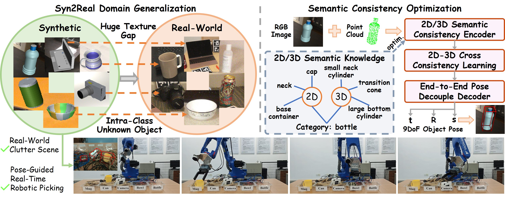

# GenCOPE: Syn2Real Generalized Category-Level Object Pose Estimation for Robotic Picking

This is the PyTorch implementation of paper **[GenCOPE](https://ieeexplore.ieee.org/document/10930708)** published in <b>*NeurIPS 2026*</b> by <a href="https://cnjliu.github.io/">J. Liu</a>, <a href="https://baike.baidu.com/item/%E5%AD%99%E7%82%9C/241837">W. Sun</a>, <a href="https://github.com/CNJianLiu/GenCOPE">Z. Dai</a>, <a href="https://scholar.google.com/citations?user=rhQSwuoAAAAJ&hl=zh-CN">H. Yang</a>, <a href="https://github.com/CNJianLiu/GenCOPE">J. Xiao</a>, <a href="https://scholar.google.com.hk/citations?user=stFCYOAAAAAJ&hl=zh-CN&oi=ao">N. Sebe</a>, and <a href="https://scholar.google.com/citations?user=KOL2dMwAAAAJ&hl=en">N. Zhao</a>. GenCOPE is a lightweight Syn2Real generalized category-level object pose estimation method with robotic integration for real-time robotic picking.

<p align="center">

</p>

## Installation
Our code has been trained and tested with:
- Ubuntu 20.04
- Python 3.8.15
- PyTorch 1.12.0
- CUDA 11.3

Complete installation can refer to our [environment](https://github.com/CNJianLiu/GenCOPE/blob/main/environment.yaml).

## Datasets
Download NOCS dataset ([CAMERA_train](http://download.cs.stanford.edu/orion/nocs/camera_train.zip), [Real_test](http://download.cs.stanford.edu/orion/nocs/real_test.zip),
[gt annotations](http://download.cs.stanford.edu/orion/nocs/gts.zip),
[mesh models](http://download.cs.stanford.edu/orion/nocs/obj_models.zip), and [segmentation results](https://drive.google.com/file/d/1hNmNRr7YRCgg-c_qdvaIzKEd2g4Kac3w/view?usp=sharing)) and Wild6D ([testset](https://ucsdcloud-my.sharepoint.com/:u:/r/personal/yafu_ucsd_edu/Documents/Wild6D/test_set.zip)). Data processing can refer to [IST-Net](https://github.com/CVMI-Lab/IST-Net).
Unzip and organize these files in ../data as follows:
```
data
├── CAMERA
├── camera_full_depths
├── Real
├── gts
├── obj_models
├── segmentation_results
├── Wild6D
```

## Training
To train the model, remember to download the synthetic CAMERA25 dataset and organize & preprocess it properly.

train.py is the main file for training. You can start training using the following command:
```
python train.py --gpus 0 --config config/diffusion_pose.yaml
```

## Evaluation
We can quickly evaluate the real-world REAL275 dataset using the following command:
```
python test.py --config config/diffusion_pose.yaml
```
The real-world Wild6D dataset can be evaluated using the following command:
```
bash test_wild6d.sh
```
Note that there is a small mistake in the original evaluation code of [NOCS](https://github.com/hughw19/NOCS_CVPR2019/blob/dd58dbf68feede04c3d7bbafeb9212af1a43422f/utils.py#L252) for the 3D IOU metrics. We thank [CATRE](https://github.com/THU-DA-6D-Pose-Group/CATRE) and [SSC-6D](https://github.com/swords123/SSC-6D) for pointing out this. We have revised it and recalculated the metrics of some methods. The revised evaluation code is given in our released [code](https://github.com/CNJianLiu/GenCOPE/blob/1ca38c2bd3f5e896470ad76dcb3ba8e64a2aeff2/utils/evaluation_utils.py#L128).


## Citation
If you find our work useful, please consider citing:
```latex
@InProceedings{Liu_2026_NeurIPS,
  author = {Liu, Jian and Sun, Wei and Dai, Zhenqi and Yang, Hui and Xiao, Jian and Sebe, Nicu and Zhao, Na},
  title = {GenCOPE: Syn2Real Generalized Category-Level Object Pose Estimation for Robotic Picking},
  booktitle = {Conference on Neural Information Processing Systems (NeurIPS)},
  year = {2026}
}
```

## Acknowledgment
Our implementation leverages the code from [DPDN](https://github.com/JiehongLin/Self-DPDN) and [IST-Net](https://github.com/CVMI-Lab/IST-Net). We thank the authors for releasing the code.

## Licence

This project is licensed under the terms of the MIT license.
